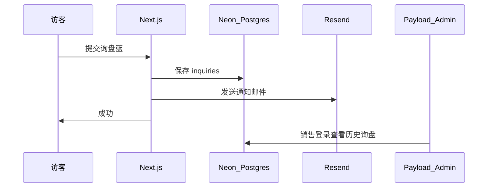

# 架构说明：逛站 + 数据库 + 邮件询盘

## 你的业务目标

客户 **浏览产品** → **发起询盘** → 你们 **收到邮件并跟进**。  
这完全合理；本项目用 **两种方式同时保障**，避免只依赖邮件时漏单。

## 双通道询盘（设计意图）

| 通道 | 优点 | 仅邮件方案的问题 |
|------|------|------------------|
| **数据库** | 可检索、可统计、后台管理、不怕邮件进垃圾箱 | 纯邮件无结构化产品列表 |
| **邮件** | 手机即时提醒、符合外贸习惯 | 邮件丢失/延迟时无备份 |

练手时你可以 **先只验证数据库通道**；转正时 **补上 Resend**，两通道都生效，**无需改代码结构**。

## 为什么需要 Postgres（Neon）

- **产品 / 分类 / 多语言**：Payload CMS 存在库里，运营可在 `/admin` 改，不用每次改代码部署。  
- **询盘记录**：[`inquiries`](E:\FC web\web\src\collections\Inquiries.ts) 集合，含 SKU 列表、客户信息。  
- **管理员**：登录 `/admin` 需要用户表。

没有数据库 = 没有当前这套 B2B 站，只能做成「静态页 + 单一联系表单」。

## 为什么还需要邮件（Resend）

- 代码已在 [`/api/inquiry`](E:\FC web\web\src\app\api\inquiry\route.ts)：入库后，若配置了 `RESEND_API_KEY` 和 `INQUIRY_TO_EMAIL` 即发信。  
- 练手可用 Resend 免费档发到 **个人 Gmail**，不必企业邮箱。  
- 转正时换成 `sales@你的域名.com` 并做 Resend 域名验证。

## 与「随时转正」的关系

| 阶段 | 你要做的 |
|------|----------|
| 练手 | Vercel + Neon + seed；邮件 Key 可选 |
| 转正 | 加域名、Resend、Turnstile、Blob 图、真 WhatsApp — **同一仓库** |

功能代码保持完整；见 [PRODUCTION-CHECKLIST.md](./PRODUCTION-CHECKLIST.md)。
